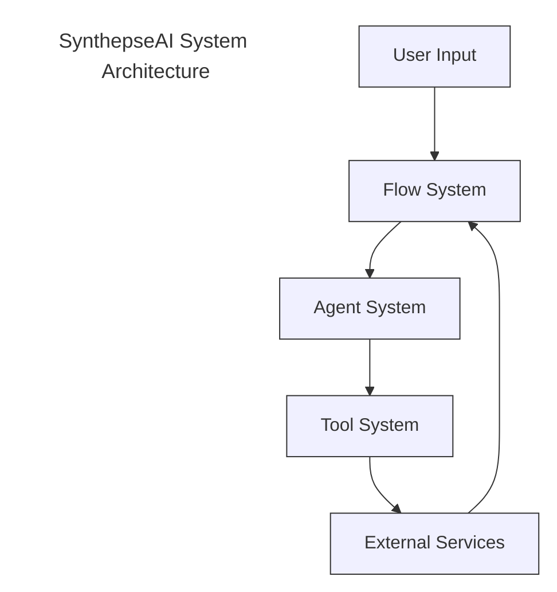
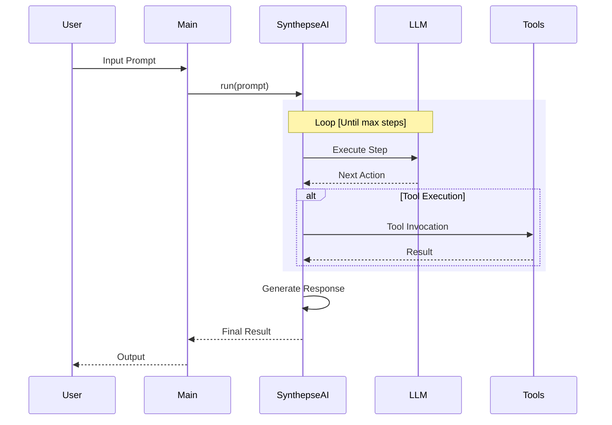
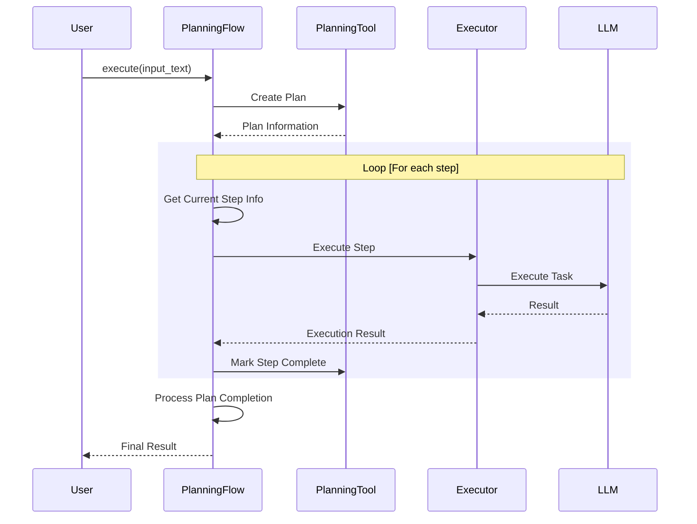
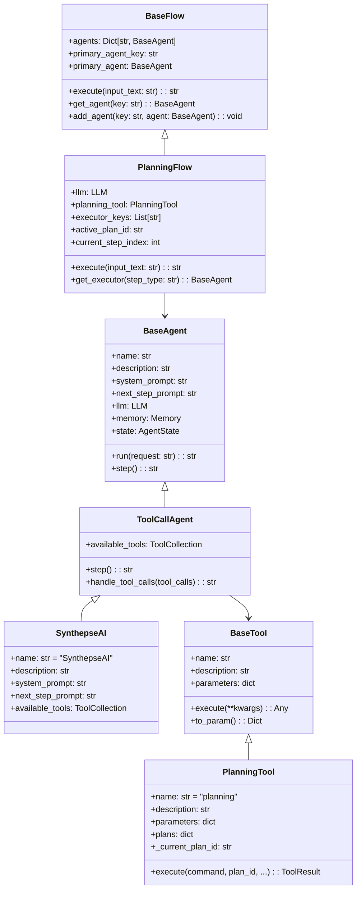
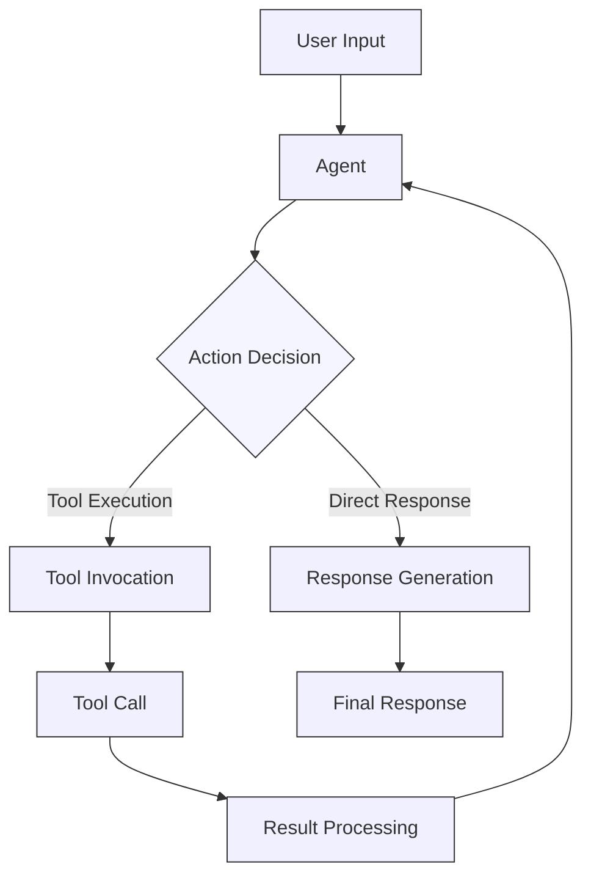
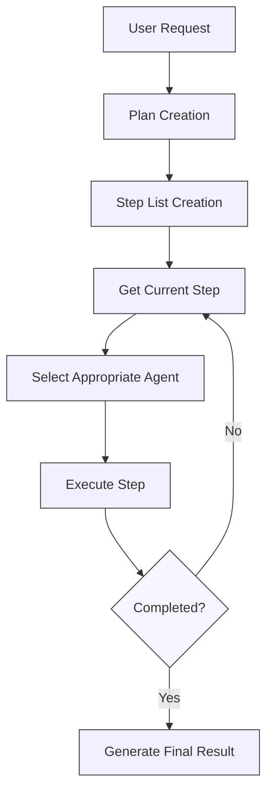
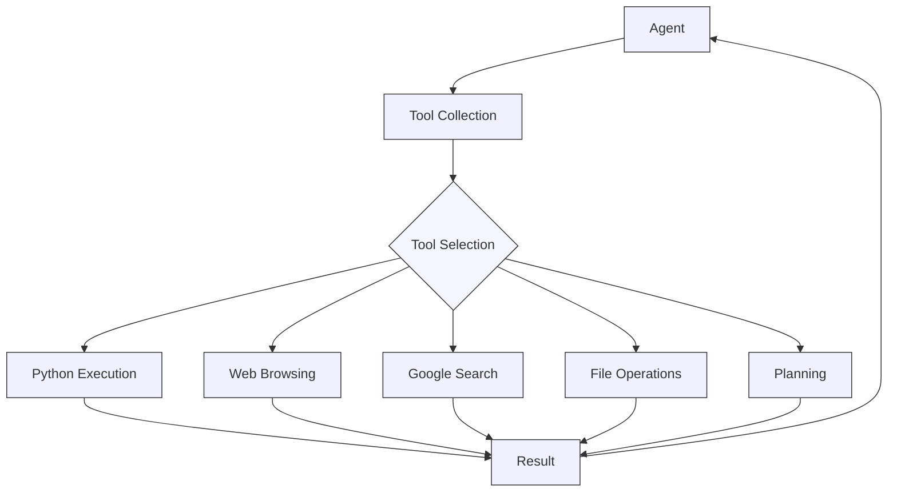

# SynthepseAI Agent

## Overview

SynthepseAI Agent is an autonomous AI agent system with self-correction capabilities. Simply by setting a goal, the agent automatically plans and executes tasks while learning from and correcting errors to achieve the objective. It is built on an extended version of the manus architecture and incorporates a learning system utilizing GraphRAG, enabling continuous improvement based on experience.

### Key Features

- **Automated Task Planning and Execution**: Decomposes complex goals into smaller tasks and automatically generates and executes Python code for each task.
- **Self-Correction Ability**: Detects errors during execution and attempts to automatically correct them.
- **Learning from Experience**: Learns from past error patterns and successful code implementations to apply to new tasks.
- **Module Reuse**: Extracts reusable modules from successful code to utilize in new tasks.
- **Isolated Execution Environments**: Each project runs in its own virtual environment to prevent dependency conflicts.

## System Requirements

### Mandatory Environment
- Python 3.9 or higher
- SQLite 3.x
- Docker (required when using Weaviate)

### Dependencies
```bash
openai>=1.0.0
weaviate-client>=3.15.0
tenacity>=8.0.0
python-dotenv>=1.0.0
sqlite3
```

## Installation

### 1. Clone the Repository
```bash
git clone https://github.com/yourusername/SynthepseAI.git
cd SynthepseAI
```

### 2. Set Up the Virtual Environment
```bash
python -m venv venv
source venv/bin/activate  # On Windows: venv\Scripts\activate
```

### 3. Install Dependencies
```bash
pip install -r requirements.txt
```

### 4. Configure Environment Variables
Create a `.env` file and include the following:
```dotenv
OPENAI_API_KEY=your_openai_api_key
OPENAI_MODEL=gpt-4-turbo
```

### 5. Set Up Weaviate (for GraphRAG)
```bash
docker-compose -f docker-compose.yml up -d
```

## Usage

### Basic Execution

```bash
# Run with a specified goal
python main.py --goal "Create a CSV file, perform data analysis, and generate graphs for the results"

# Run with a specified workspace directory
python main.py --goal "Perform web scraping to collect data" --workspace ./custom_workspace

# Run in debug mode
python main.py --goal "Process a text file and compute statistics" --debug
```

### Example Run

```bash
# Execute a sample task
python example.py
```

### Enabling the Learning Feature

```bash
# Enable learning using GraphRAG
python main.py --goal "Extract text from image files" --weaviate-url "http://localhost:8080"
```

## Project Structure

```
SynthepseAI/
├── main.py                    # Main entry point
├── example.py                 # Sample execution script
├── config.json                # Configuration file
├── requirements.txt           # Dependency list
├── docker-compose.yml # Weaviate configuration file
├── core/                      # Core modules
│   ├── auto_plan_agent.py     # Self-correcting agent
│   ├── base_agent.py          # Base agent
│   ├── base_flow.py           # Base flow
│   ├── graph_rag_manager.py   # GraphRAG manager
│   ├── llm.py                 # LLM integration
│   ├── modular_code_manager.py # Module manager
│   ├── planning_flow.py       # Planning flow
│   ├── project_environment.py # Project environment
│   ├── script_templates.py    # Script templates
│   ├── task_database.py       # Task database
│   ├── tool_agent.py          # Tool agent
│   └── tools/                 # Tool modules
│       ├── base_tool.py       # Base tool
│       ├── file_tool.py       # File operations
│       ├── package_manager.py # Package management
│       ├── planning_tool.py   # Planning tool
│       ├── python_execute.py  # Python execution
│       ├── python_project_execute.py # Project environment execution
│       ├── docker_execute.py  # Docker execution
│       └── system_tool.py     # System operations
└── workspace/                 # Working directory
    ├── modules/               # Reusable modules
    └── project_{plan_id}/     # Project environment
        ├── venv/              # Virtual environment
        ├── task_{task_id}.py  # Task script
        ├── requirements.txt   # Dependencies
        └── installed_packages.json # Installed packages
```

## Architecture and Design Philosophy

SynthepseAI Agent is composed of the following main components:

### System Architecture Overview



### Basic Execution Flow



### Planning Flow



### Class Structure



### Agent Execution System



### Planning System



### Tool Integration System



## Main Components

### 1. Agent System
- **BaseAgent**: The base class for all agents.
- **ToolAgent**: An agent with tool invocation capabilities.
- **AutoPlanAgent**: An agent capable of automatic planning, execution, and self-repair.

### 2. Flow System
- **BaseFlow**: The base class for flows.
- **PlanningFlow**: Manages planning and execution flows.

### 3. Tool System
- **PlanningTool**: For planning and managing tasks.
- **PythonExecuteTool**: For executing Python code.
- **PythonProjectExecuteTool**: For executing Python code in a project environment.
- **FileTool**: For file operations.
- **DockerExecuteTool**: For executing Docker commands.
- **SystemTool**: For system operations.

### 4. Learning System
- **GraphRAGManager**: For learning and retrieving error and code patterns.
- **ModularCodeManager**: For managing reusable code modules.

### 5. Database
- **TaskDatabase**: An SQLite-based task and plan manager.

### 6. Environment Management
- **ProjectEnvironment**: Manages virtual environments on a per-project basis.

## Workflow

1. **Goal Input**: The user inputs the goal to be achieved.
2. **Plan Generation**: The goal is broken down into smaller tasks.
3. **Code Generation**: Python code is automatically generated for each task.
4. **Environment Setup**: An isolated environment is prepared for task execution.
5. **Task Execution**: Tasks are executed sequentially with dependency management.
6. **Error Handling**: Failed tasks are automatically corrected.
7. **Learning**: Successful patterns are recorded for future tasks.
8. **Result Reporting**: A summary of the execution results is generated and returned.

## Learning System

SynthepseAI Agent incorporates two learning mechanisms:

### GraphRAG Learning System
- **Error Pattern Learning**: Records encountered errors and successful fixes.
- **Task Template Learning**: Accumulates successful code patterns for each task type.
- **Contextual Retrieval**: Uses similar task resolutions to enhance prompt performance.

### Module Reuse System
- **Module Extraction**: Extracts reusable code from successful tasks.
- **Dependency Management**: Maintains dependencies between modules.
- **Contextual Application**: Automatically incorporates relevant modules into new tasks.

## Extending the System

### Adding New Tools

1. Create a new tool class in the `core/tools/` directory.
2. Inherit from `BaseTool` and implement the necessary methods.
3. Register the new tool with `AutoPlanAgent`.

```python
# Example of creating a new tool
class NewTool(BaseTool):
    def __init__(self):
        super().__init__("new_tool", "Description of the new tool")
        self.parameters = {...}
    
    def execute(self, **kwargs) -> ToolResult:
        # Implementation...
        return ToolResult(...)

# Registering the tool
agent.available_tools.add_tool(new_tool)
```

### Extending the Learning System

1. Add new search and storage methods to `GraphRAGManager`.
2. Extend the Weaviate schema to store new data types.

## Troubleshooting

### Common Issues and Solutions

#### OpenAI API Connection Error
```
Error: OpenAI API connection failed...
```
*Solution*: Verify that the API key is correctly set. Also, check your network connection and the status of the OpenAI API.

#### ModuleNotFoundError
```
ModuleNotFoundError: No module named 'some_module'
```
*Solution*: Manually install the required package or use the `--debug` flag for more details.

#### SQLite Database Error
```
sqlite3.OperationalError: no such table...
```
*Solution*: Ensure that the database file exists. If necessary, delete it and create a new database.

#### Weaviate Connection Error
```
Error connecting to Weaviate...
```
*Solution*: Verify that the Weaviate container is running by executing `docker-compose -f weaviate-docker-compose.yml ps` to check its status.

## License

MIT License

## Contribution Guidelines

1. Fork the repository.
2. Create a new branch (`git checkout -b feature/amazing-feature`).
3. Commit your changes (`git commit -m 'Add amazing feature'`).
4. Push the branch (`git push origin feature/amazing-feature`).
5. Create a Pull Request.

## Developer Information

### Code Style
- Adheres to PEP 8 coding style.
- Docstrings are required for all classes and public methods.
- Code formatting follows the Black style.

### Testing
```bash
# Run tests
python -m unittest discover tests
```

### Documentation Generation
```bash
# Generate API documentation
sphinx-build -b html docs/source docs/build
```

---

**Note**: This system is under development and may behave unexpectedly. Please create backups of any critical data before processing.

**Version**: 0.1.0
